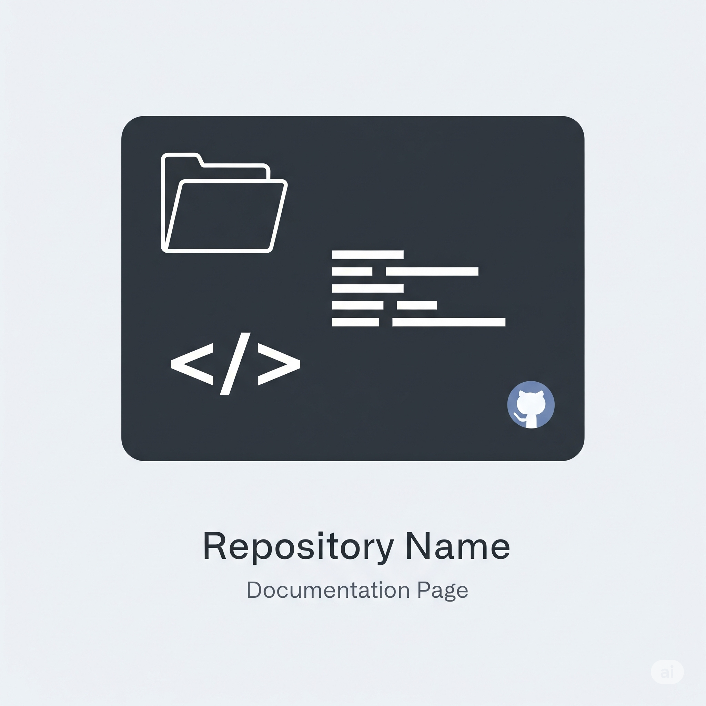

# My Awesome Project

This is the documentation for my awesome project.

## Introduction

This section provides a general overview of the project.


## Features

Here are some of the key features:

- Feature A
- Feature B
- Feature C

### Feature Details

Here's a more detailed look at the features:

| Feature | Description |
|---|---|
| Feature A | Does something amazing. |
| Feature B | Does something even more amazing. |
| Feature C | The most amazing feature of all. |

## Usage

Here's how to use the project.

```bash
# Installation
npm install my-awesome-project

# Usage
import myAwesomeProject from 'my-awesome-project';

myAwesomeProject.doSomething();
```




## Contributing

We welcome contributions! Please see our contributing guidelines for more information.