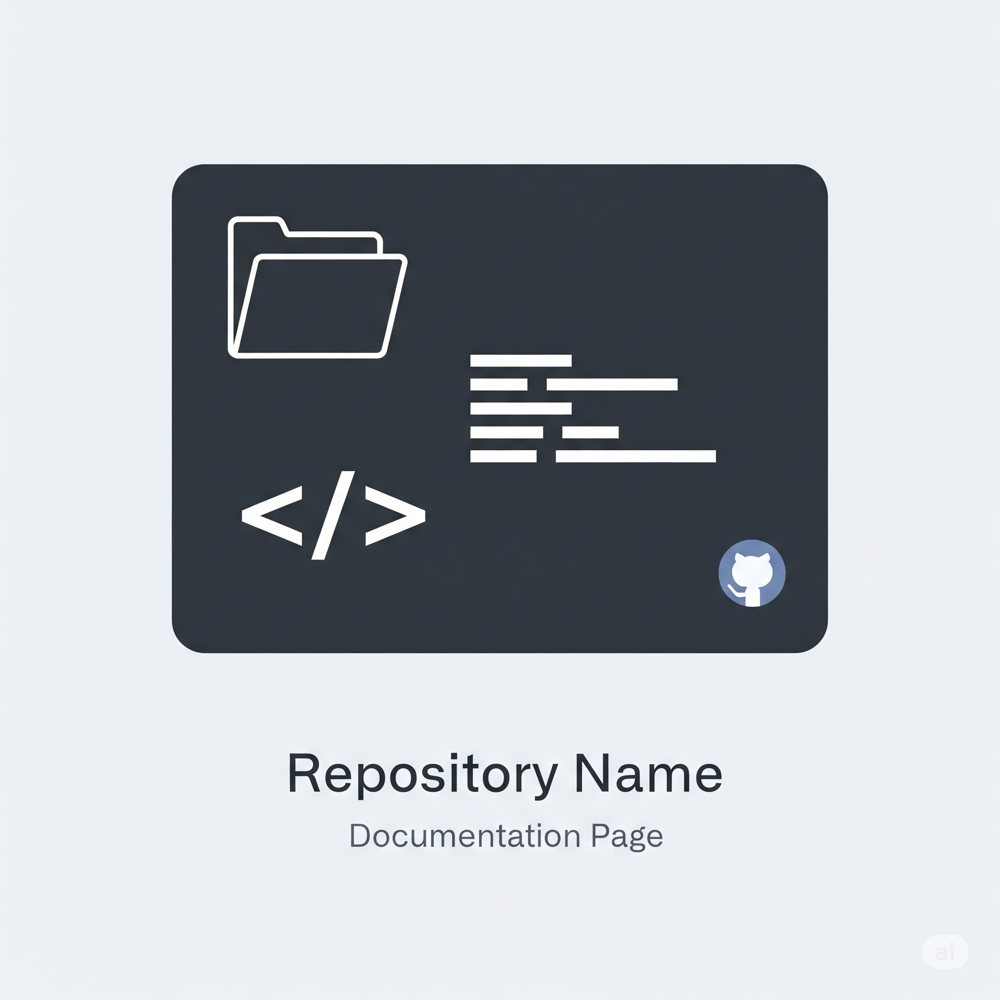
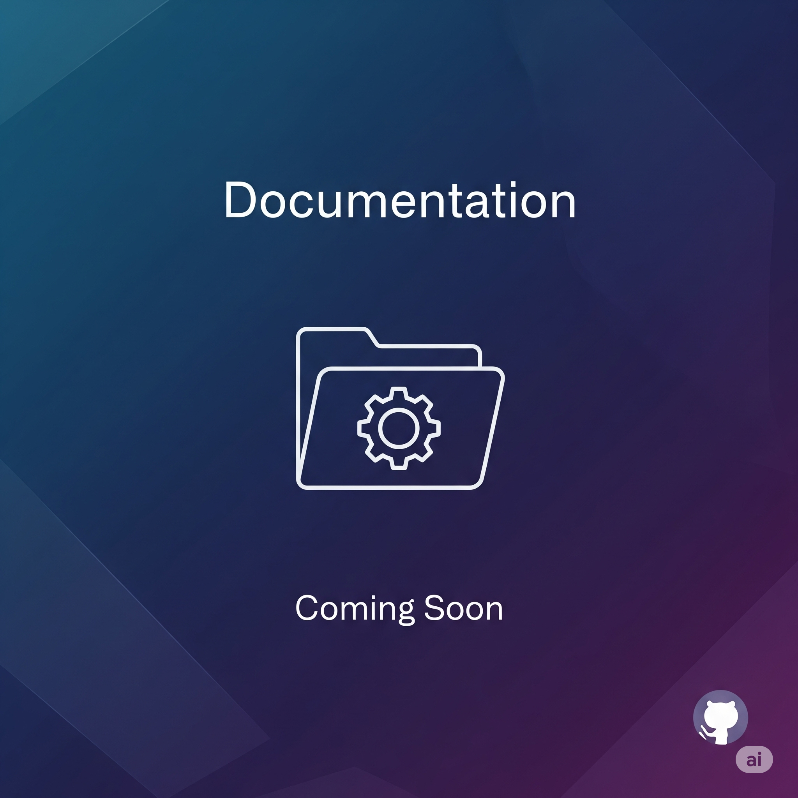

# Meu Projeto Incrível

Esta é a documentação para o meu projeto incrível.

## Introdução

Esta seção fornece uma visão geral do projeto.


## Funcionalidades

Aqui estão algumas das principais funcionalidades:

- Funcionalidade A
- Funcionalidade B
- Funcionalidade C

### Detalhes das Funcionalidades

Veja uma visão mais detalhada das funcionalidades:

| Funcionalidade | Descrição |
|---|---|
| Funcionalidade A | Faz algo incrível. |
| Funcionalidade B | Faz algo ainda mais incrível. |
| Funcionalidade C | A funcionalidade mais incrível de todas. |

## Como Usar

Veja como usar o projeto.

```bash
# Instalação
npm install meu-projeto-incrivel

# Como Usar
import meuProjetoIncrivel from 'meu-projeto-incrivel';

meuProjetoIncrivel.facaAlgo();
```





## Contribuições

Contribuições são bem-vindas! Por favor, veja nossas diretrizes de contribuição para mais informações.